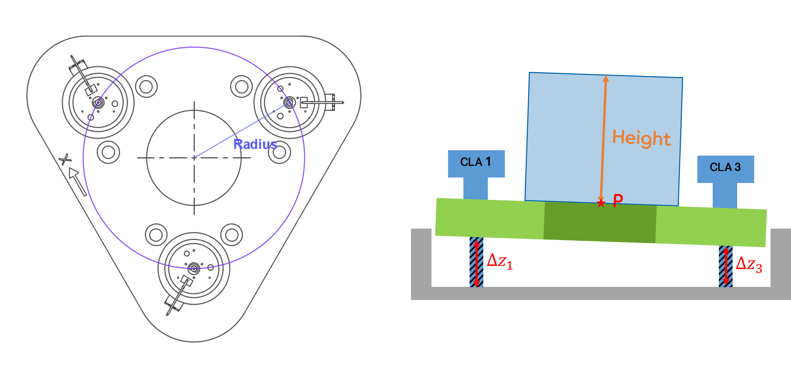

JPE Cryo Positioning Systems Controller(CPSC) GUI
=================================================================

Initial Setup
-----------------------------------------------------------------
해당 GUI는 CADM 3개로 구성된 CPSC를 동작을 편리하게 하기위해 제작한 GUI python을 기반으로 동작합니다. \
CPSC는 serial 통신으로 구동되므로, 미리 pyserial을 설치하셔야 합니다.
    
    pip install pyserial

pip를 활용하여 pyserial을 설치할 수 있습니다.

 Serial Communication 창
------------------------------------------------------------------
### Interface

COM port number와 Baudrate를 설정하면, 해당 port에 commad를 삽입할 수  있습니다. 

- commad 창에 원하는 command 입력한 후 enter 버튼 혹은 enterkey을 누르면 해당 command가 설정한 port에 입력됩니다.
- 입력한 command 값은 "<<< cammand 값"의 형태로 창에 나타납니다.
- 입력한 command에 대한 respond 값은 ">>> respond 값"으로 발생합니다.

### 구동결과

  

 

### 주요 Command
|Command|설명|
|---------------|-------------------------------------------|
|/VER| 컨트롤러의 Firmware 버전 확인|
|/MODLIST | 컨트롤러에 설치된 모듈 확인|
|/STAGES | 사용 가능한 Actuator와 Stage의 종류 확인|
|/GBR [INTERFACE]| 설정된 Baudrate를 확인한다.|
|/SBR [INTERFACE] [BAUDRATE]| Baudrate를 설정한다.|

Motion Control 창
---------------------------------------------------------
### Interface

CADM 동작을 간단한 버튼을 통해 제어할 수 있습니다.

#### parameter 설명
|Parameter|설명|
|---------------|-------------------------------------------|
|Frequency [Hz] |Step의 Frequency 설정|
|Temperature [K]|동작 환경의 온도|
|Step Size [%]  |적용되는 Step 사이즈를 % 기준으로 조정함(최대한 100%로 사용하길 권장)|
|Drive Factor   |? (정상적인 환경에서는 1로 설정)|
|Steps| 동작하는 Step수로 0이면 지속적으로 진행한다.|

#### Button 설명
|Button |설명|
|---------------|-------------------------------------------|
|State |각 Address의 상태를 알려주는 버튼 (빨간 LED가 켜진 경우 Error 원인을 확인할 수 있음)|
|Move|설정한 Steps에 맞게 해당 Address가 동작하게 된다.|
|Stop |반복 동작이 시행된 상황에서 해당 Address의 동작을 멈춘다.|

### 구동결과

  

 

XYZ Motion Control 창
---------------------------------------------------------
### Interface

#### parameter 설명

|Parameter|설명 |
|---------------|-------------------------------------------|
|Steps | 해당 방향 (x, y, z)으로 이동할 Step 수를 설정 |
|Radius (mm) | 중심으로 부터 Actuater까지 거리 (int)|
|Height (mm) | Stage의 위면에 놓인 물체의 높이 (int)|

#### Move _XYZ Flow Chart

  

 

#### 구동 결과

  

 
 

